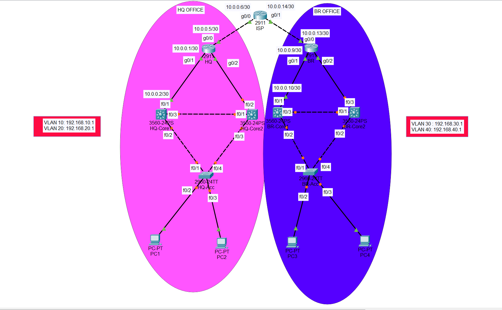

# enterprise-network-lab
Multi-site enterprise network lab built in Packet Tracer featuring VLAN segmentation, inter-VLAN routing, OSPF dynamic routing with redistribution, NAT (PAT), DHCP with relay, ACL-based traffic control, and HSRP for gateway redundancy.
# Enterprise Network Lab (Packet Tracer)

##  Overview
This project simulates a multi-site enterprise network with redundancy, dynamic routing, and security controls.

## Features Implemented
- VLAN segmentation (Users/Admin)
- Inter-VLAN routing (Layer 3 switches)
- Static routing → migrated to OSPF
- NAT (PAT) for internet simulation
- DHCP with relay (ip helper-address)
- ACL for traffic filtering
- HSRP for gateway redundancy

## Network Design
- Two sites: HQ and Branch
- ISP router connecting both sites
- Redundant core switches using HSRP
- Access layer switches for end devices

## Technologies Used
- OSPF (dynamic routing)
- HSRP (high availability)
- NAT (overload)
- DHCP
- ACL
- VLANs & trunking

## Topology

## 📂 Configurations
See `/configs` folder for full device configurations.

## Key Takeaways
- Designed scalable multi-site network
- Implemented redundancy and failover
- Transitioned from static to dynamic routing
- Applied security and segmentation
